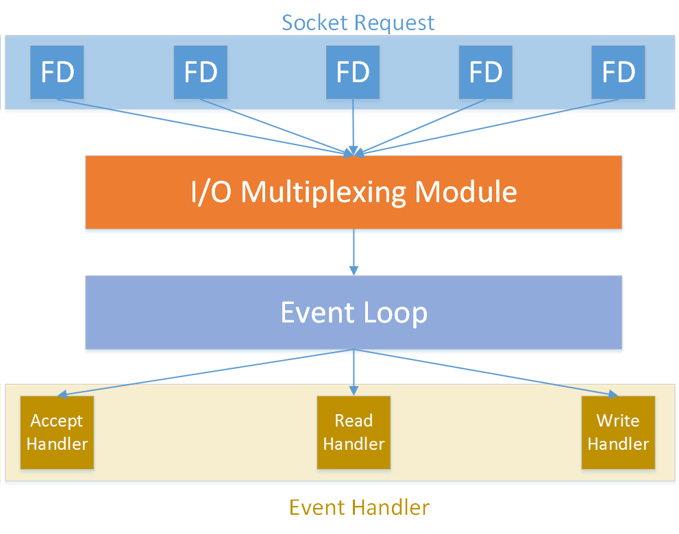

## Chapter 1 Getting Started with Redis


相关主题：

- `Redis` 下载与安装
- `Redis` 启动与关闭
- 用 `redis-cli` 连接 `Redis`
- 获取服务器信息
- 理解 `Redis` 事件模型
- 理解 `Redis` 协议

---


## 1.0 简介

定义：`Redis` 是一种很流行的、基于内存的、轻量级键值对数据库。严格来讲，是一种数据结构的服务器（[Matt Stancliff](https://matt.sh/thinking-in-redis-part-one)）。

名称由来：**RE**mote **DI**ctionary **S**erver，由于在内存中原生实现了多种数据结构，并提供了大量操作这些数据结构的 API 接口，故而得名。

特点：

- 命令处理方面性能卓越；
- 高可用、高可扩展的架构设计；
- 数据持久化的特性，可提供长期运行的数据存储服务


## 1.1 下载与安装

`Redis` 在 `GitHub` 上异常活跃，由于提交的大量 `pull request` 几乎都能得到作者 `Antirez` 的及时处理，`Redis` 的发布速度也很快。建议尽可能使用最新版（原书版本为 `v4.0.1`，目前稳定版为 `v6.2.6`），这也是 `Redis` 的最佳实践之一。

`Redis` 是用 C 语言编写的，各主流 `Linux` 系统的软件库中也提供了相应的二进制安装包，只是版本略有落后。

`Redis` 下载：https://redis.io/download

若要在 `Linux` 系统编译源码安装 `Redis`，需要确保 `gcc` 编译器及 C 语言库 `libc` 可用。

若从操作系统的软件库安装 `Redis`，只需要确保主机正常联网即可。

### 1.1.1 源码编译安装

安装步骤：

```bash
# under WSL environment (2022-1-7 15:15:22)
# Set up building tools
$ apt-get update
$ sudo apt-get install build-essential
$ mkdir /redis
$ cd /redis 
# download latest redis -- using curl 
$ curl http://download.redis.io/releases/redis-6.2.6.tar.gz > redis-6.2.6.tar.gz
# or using wget
$ wget http://download.redis.io/releases/redis-6.2.6.tar.gz
$ tar zxvf redis-4.0.1.tar.gz 
$ cd redis-6.2.6
# Create a directory for the Redis configuration file and copy the default configuration file into it
$ mkdir /redis/conf
$ cp redis.conf /redis/conf/
# building dependencies
$ cd deps 
$ make hiredis lua jemalloc linenoise 
$ cd .. 
$ make
```

当看到如下提示内容，表示编译成功：

```markdown
Hint: It's a good idea to run 'make test' ;)

make[1]: Leaving directory '/redis/redis-6.2.6/src'
```

接下来安装 `Redis`：

```bash
$ make PREFIX=/redis install 
# run test
$ make test
```

实测发现当前 `WSL` 环境的 `TCL` 工具版本较低，测试中断。根据系统建议，需要升级到 `8.5` 以上：

```markdown
You need tcl 8.5 or newer in order to run the Redis test
```

升级 `tcl` 工具到 `8.6.1` （详见 [CSDN 博文](https://blog.csdn.net/a1209849629/article/details/105757593/)）：

```bash
$ wget http://downloads.sourceforge.net/tcl/tcl8.6.1-src.tar.gz  
$ sudo tar xzf tcl8.6.1-src.tar.gz -C /usr/local/  
$ cd /usr/local/tcl8.6.1/unix/  
$ sudo ./configure  
$ sudo make  
$ sudo make install
```

再次回到 `/redis/redis-6.2.6` 目录执行测试（运行成功）：

```bash
$ make test
...
Testing solo test
[ok]: Active defrag
[ok]: Active defrag big keys
[ok]: Active defrag big list
[ok]: Active defrag edge case
[64/64 done]: defrag (57 seconds)

                   The End

Execution time of different units:
  0 seconds - unit/printver
  0 seconds - unit/type/incr
...
  57 seconds - defrag

\o/ All tests passed without errors!

Cleanup: may take some time... OK
make[1]: Leaving directory '/redis/redis-6.2.6/src'
```

最后查看 `/redis/bin` 目录下的 `Redis` 二进制文件是否已生成（安装成功）：

```bash
# verify Redis binary files have been generated
$ ls /redis/bin/
redis-benchmark  redis-check-aof  redis-check-rdb  redis-cli  redis-sentinel  redis-server
```


### 1.1.2 软件库默认在线安装

```bash
$ sudo apt-get update 
$ sudo apt-get install redis-server 
$ which redis-server 
```


### 1.1.3 Windows 版安装

下载 Windows 版安装包：https://github.com/MicrosoftArchive/redis/releases

目前最新版为 2016 年 7 月 1 日发布的 [v3.2.100](https://github.com/microsoftarchive/redis/releases/tag/win-3.2.100)

下载并双击 `.msi` 安装包即可。


### 1.1.4 注意事项

`Redis` 遵守版本管理标准规范，版本格式为：`major.minor.patch`。次版本若为偶数，表示稳定版；奇数表示非稳定版。

源码编译安装和系统默认安装的区别，在于前者可在编译时添加优化或调试用的配置参数，并能自定义安装路径。

`bin` 文件夹下的主要二进制文件如下：

- `redis-server`
- `redis-sentinel`
- `redis-cli`
- `redis-check-rdb`
- `redis-check-aof`
- `redis-benchmark`


## 1.2 启动与关闭

本节示例代码均在 `/redis/` 文件夹下进行。

### 1. 默认配置启动

```bash
$ bin/redis-server
```

### 2. 手动指定配置文件启动

```bash
$ bin/redis-server conf/redis.conf
```

此时无法进行其他操作，当前控制被占用：


### 3. 通过 `init.d` 脚本启动

```bash
$ /etc/init.d/redis-server start
```


### 4. 作为 `daemon` 守护进程启动

```bash
# edit configuration file
$ vim conf/redis.conf
daemonize yes 
$ bin/redis-server conf/redis.conf
```

修改情况：


再次通过配置文件启动 `Redis`（后台执行成功，不影响后续操作）：

```bash
$ ./bin/redis-server conf/redis.conf
# check redis status
```

结果如下（启动成功）：


### 5. 使用 `kill pid` 关闭

```bash
$ ps -ef | grep redis
root     22083     9  0 17:37 ?        00:00:00 ./bin/redis-server 127.0.0.1:6379
root     22091    10  0 17:49 pts/0    00:00:00 grep --color=auto redis
$ kill 22083
```


### 6. 使用 `redis-cli` 关闭

```bash
$ cd /redis 
$ bin/redis-cli shutdown 
```


### 7. 通过 `init.d` 脚本关闭（系统在线安装）

```bash
$ /etc/init.d/redis-server stop 
```


### 8. 注意事项

一台主机可以运行多个 `Redis` 实例，只要指定不同的配置信息即可，如绑定不同的端口、不同的数据持久化路径、不同的日志路径等等。

`Redis` 中 **实例**（`instance`）的本质，是 `redis-server` 的一个进程（`process`）。

`Redis` 的关闭可能涉及数据完整性的问题，因此需要格外注意。应该尽量避免使用 `kill` 命令强制中断。推荐使用客户端的 `shutdown` 命令。

> 执行 `shutdown` 命令的内部先后顺序：
>
> 1. 首先停止 `redis-server` 的所有客户端连接；
> 2. 然后清理可能存在的 `.pid` 文件和 `socket` 文件；
> 3. 最后才会退出 `Redis` 进程。
>
> 这样的执行策略可以最大限度保证数据完整性不被破坏。

如果要在一台主机部署多个参数不同的 `Redis` 实例，可以将公共参数放到一个同一的配置文件，然后各实例的定制化参数在 `redis-server` 命令中单独指定。这样可以将维护多处配置文件的情况降至最低。不同的实例可以通过 `ps` 命令获取 `pid` 加以区分。


## 1.3 用 `redis-cli` 连接 `Redis`

`redis-cli` 是 `bin` 目录下最常用的客户端工具。

```bash
# Start redis
$ cd /redis
$ ./bin/redis-server conf/redis.conf
# Connect 
$ bin/redis-cli 
127.0.0.1:6379> set foo value1
OK
127.0.0.1:6379> set bar value2
OK
127.0.0.1:6379> get foo
"value1"
127.0.0.1:6379> get bar
"value2"
# shutdown
127.0.0.1:6379> shutdown
not connected>
# press 'quit' or 'exit' to exit
not connected> quit
127.0.0.1:6379> exit
```

通过命令行关闭 `Redis` 后，服务端随即关闭，此时直接重连将报错：

```bash
127.0.0.1:6379> shutdown
not connected> quit
$ ./bin/redis-cli
Could not connect to Redis at 127.0.0.1:6379: Connection refused
not connected> 
```

若想恢复连接状态，必须重新启动 `Redis` 服务端。

默认情况下，`redis-cli` 通过默认端口 `6379` 连接到在 `localhost` 上运行的 `Redis` 实例。`redis-cli` 命令还可以通过 `-h` 指定 `IP`、通过 `-p` 指定端口号、通过 `-a` 指定访问密码。


## 1.4 获取服务器信息

使用 `redis-cli` 连接 `Redis` 后，可以通过 `INFO`（大小写均可，默认大写）命令获取服务器信息：

```bash
$ ./bin/redis-cli
127.0.0.1:6379> INFO
# Server
redis_version:6.2.6
redis_git_sha1:00000000
redis_git_dirty:0
redis_build_id:c0bf07cbfe6c3f03
redis_mode:standalone
os:Linux 4.4.0-19041-Microsoft x86_64
arch_bits:64
multiplexing_api:epoll
atomicvar_api:c11-builtin
gcc_version:9.3.0
process_id:195
process_supervised:no
run_id:0456fe1d8140dfd148d4eb7b54413e80ba0db972
tcp_port:6379
server_time_usec:1641833182569687
uptime_in_seconds:341
uptime_in_days:0
hz:10
configured_hz:10
lru_clock:14443230
executable:/redis/./bin/redis-server
config_file:/redis/conf/redis.conf
io_threads_active:0

# Clients
connected_clients:1
cluster_connections:0
maxclients:10000
client_recent_max_input_buffer:16
client_recent_max_output_buffer:0
blocked_clients:0
tracking_clients:0
clients_in_timeout_table:0

# Memory
used_memory:873904
used_memory_human:853.42K
used_memory_rss:5349376
used_memory_rss_human:5.10M
used_memory_peak:932104
used_memory_peak_human:910.26K
used_memory_peak_perc:93.76%
used_memory_overhead:830624
used_memory_startup:809984
used_memory_dataset:43280
used_memory_dataset_perc:67.71%
allocator_allocated:1062688
allocator_active:1384448
allocator_resident:4800512
total_system_memory:33720778752
total_system_memory_human:31.40G
used_memory_lua:37888
used_memory_lua_human:37.00K
used_memory_scripts:0
used_memory_scripts_human:0B
number_of_cached_scripts:0
maxmemory:0
maxmemory_human:0B
maxmemory_policy:noeviction
allocator_frag_ratio:1.30
allocator_frag_bytes:321760
allocator_rss_ratio:3.47
allocator_rss_bytes:3416064
rss_overhead_ratio:1.11
rss_overhead_bytes:548864
mem_fragmentation_ratio:6.44
mem_fragmentation_bytes:4518240
mem_not_counted_for_evict:0
mem_replication_backlog:0
mem_clients_slaves:0
mem_clients_normal:20496
mem_aof_buffer:0
mem_allocator:jemalloc-5.1.0
active_defrag_running:0
lazyfree_pending_objects:0
lazyfreed_objects:0

# Persistence
loading:0
current_cow_size:0
current_cow_size_age:0
current_fork_perc:0.00
current_save_keys_processed:0
current_save_keys_total:0
rdb_changes_since_last_save:0
rdb_bgsave_in_progress:0
rdb_last_save_time:1641832841
rdb_last_bgsave_status:ok
rdb_last_bgsave_time_sec:-1
rdb_current_bgsave_time_sec:-1
rdb_last_cow_size:0
aof_enabled:0
aof_rewrite_in_progress:0
aof_rewrite_scheduled:0
aof_last_rewrite_time_sec:-1
aof_current_rewrite_time_sec:-1
aof_last_bgrewrite_status:ok
aof_last_write_status:ok
aof_last_cow_size:0
module_fork_in_progress:0
module_fork_last_cow_size:0

# Stats
total_connections_received:1
total_commands_processed:4
instantaneous_ops_per_sec:0
total_net_input_bytes:73
total_net_output_bytes:32696
instantaneous_input_kbps:0.00
instantaneous_output_kbps:0.00
rejected_connections:0
sync_full:0
sync_partial_ok:0
sync_partial_err:0
expired_keys:0
expired_stale_perc:0.00
expired_time_cap_reached_count:0
expire_cycle_cpu_milliseconds:6
evicted_keys:0
keyspace_hits:0
keyspace_misses:0
pubsub_channels:0
pubsub_patterns:0
latest_fork_usec:0
total_forks:0
migrate_cached_sockets:0
slave_expires_tracked_keys:0
active_defrag_hits:0
active_defrag_misses:0
active_defrag_key_hits:0
active_defrag_key_misses:0
tracking_total_keys:0
tracking_total_items:0
tracking_total_prefixes:0
unexpected_error_replies:0
total_error_replies:0
dump_payload_sanitizations:0
total_reads_processed:5
total_writes_processed:4
io_threaded_reads_processed:0
io_threaded_writes_processed:0

# Replication
role:master
connected_slaves:0
master_failover_state:no-failover
master_replid:1906eebefb8fe2eff6d2e3663b19d9c74e0919c3
master_replid2:0000000000000000000000000000000000000000
master_repl_offset:0
second_repl_offset:-1
repl_backlog_active:0
repl_backlog_size:1048576
repl_backlog_first_byte_offset:0
repl_backlog_histlen:0

# CPU
used_cpu_sys:0.031250
used_cpu_user:0.000000
used_cpu_sys_children:0.000000
used_cpu_user_children:0.000000
used_cpu_sys_main_thread:0.031250
used_cpu_user_main_thread:0.000000

# Modules

# Errorstats

# Cluster
cluster_enabled:0

# Keyspace
db0:keys=2,expires=0,avg_ttl=0
127.0.0.1:6379> 
```

可以看到，列出的信息自动分为了几大类。在 `info` 命令后可以指定某个子类名称（不区分大小写）单独查看，具体信息通过 `量度名称:量度值` 的格式展示，方便后期解析：

```bash
127.0.0.1:6379> info cpu
# CPU
used_cpu_sys:0.031250
used_cpu_user:0.000000
used_cpu_sys_children:0.000000
used_cpu_user_children:0.000000
used_cpu_sys_main_thread:0.031250
used_cpu_user_main_thread:0.000000
```

各类信息简介如下：

|     类别      |             含义             |
| :-----------: | :--------------------------: |
|   `Server`    |    `Redis` 服务器基本信息    |
|   `Clients`   |    客户端连接状态、指标等    |
|   `Memory`    |       总体内存消耗指标       |
| `Persistence` |  数据持久化相关状态、指标等  |
|    `Stats`    |         一般统计信息         |
| `Replication` | 主从备份模式下的状态、指标等 |
|     `CPU`     |        `CPU` 开销情况        |
|   `Cluster`   |       `Redis` 集群状态       |
|  `Keyspace`   |      数据库相关统计信息      |

这些服务器状态信息，可以在 `shell` 命令行直接执行，再将结果传给其它 `shell` 脚本，就能很方便地进行 **指标分析** 或 **性能监控**。另外，通过定期获取 `INFO` 结果构建 `Redis` 性能监控程序，也是一种常见的实践应用。


## 1.5 理解 `Redis` 事件模型

`Redis` 以高性能著称。它充分利用了单线程、非阻塞 I/O 模型来快速处理请求。因此，了解 `Redis` 的事件模型至关重要。本节演示了一个基于 `Redis` 异步事件库（`ae` 库）构建的 `echo-server` 演示程序，通过分析示例项目中的核心源代码，加深对 `Redis` 事件处理模型的印象。

本节涉及 C 语言项目的源代码构建和调试。用到的 `IDE` 是 `Ubuntu Desktop 16.04.3 LTS` 中的 `CLion`。最终的效果是客户端发送什么，服务端就返回什么。由于示例项目的编译构建不是本节重点，为了着重介绍 `Redis` 事件模型，这里项目编译过程从略，仅论述事件模型的核心知识点。

开篇提到过，`Redis` 在其单一的主进程中高效利用了非阻滞的、多路复用的 I/O 模型来完成各项任务。`Redis` 包含一个简单但功能强大的异步事件库，称为 `ae`（即英文异步事件 **a**synchronous **e**vent 的缩写），用于封装不同操作系统的轮询工具（如 `epoll`、`kqueue`、`select` 等）。

可以用一个虚拟场景来类比操作系统的轮询机制。假设顾客在餐馆点了五道菜。需要在窗口第一时间取菜。此时可能有三种取菜策略：

- 不停地走到窗口查看，直到五道菜做好；
- 叫五个人，一人负责等一个菜；
- 自己坐在一边等，一旦菜炒好了，厨师在窗口叫顾客去取。

显然最后一种方式更高效。

而操作系统的轮询原理与策略三类似。以 `Linux` 中的 `epoll` API 为例 ——

1. 调用 `epoll_create` 来告诉内核要用到 `epoll` 轮询服务；
2. 调用 `epoll_ctl` 来告诉内核文件描述符（**FD**）以及 **FD** 更新时要关注的事件类型；
3. 调用 `epoll_wait`，等待在 `epoll_ctl` 中设置的 **FD** 的某些事件发生。**FD** 更新时内核会发送通知。此时就可以为某些事件绑定要执行的业务逻辑。

`Redis` 的多路复用 `I/O` 模型示意图如下：



`Redis` 中的 `ae` 库基本会按照前面的流程来处理请求。演示项目 `echo-server` 与之类似：

`echo-server` 项目首先调用 `aeCreateEventLoop` 来创建 **事件循环**；

然后用 `anetTcpServer` 建立一个 **TCP 服务器**，用于网络绑定和监听；

再用 `anetNonBlock` 来指定这个 **socket FD** 的 **非阻塞 I/O 操作**；

接着，让 **事件循环** 为 **socket FD** 指定 **接受事件回调方法** `acceptProc`，以便服务端在建立 TCP 连接后触发 `acceptProc` 中的相关操作；

在 `acceptProc` 程序中，`anetTcpAccept` 用于接收连接请求，并为 `readProc` 注册 **socket FD** 的 **可读事件**；然后调用 `readProc`，在读取发往服务器的数据的同时，注册 **socket FD** 的 **可写事件**。最后，再由 **事件循环** 接收、触发 `writeProc`，并将结果返回到 **socket 客户端**。

值得注意的是，轮询进程中没有 *线程或子进程* **产生** 或 **发生交互**。这样就构成一种轻量级的上下文切换 I/O 模型，使得上下文切换的成本不高。由于轮询模型中，`Redis` 不会处理任何其他命令，直到正在处理的命令完成。因此在使用 `Redis` 时要特别留意 **意外延迟** 带来的问题。


## 1.6 理解 `Redis` 协议

`Redis` 作为一个非阻塞的、`I/O` 多路复用的 `TCP` 服务器，可以使用多种语言与 `Redis` 建立 `TCP` 连接。小节标题中的 `protocol`，就是服务器与客户端进行网络通信的语言。`Redis` 的通信协议叫 `RESP`（**REdis Serialization Protocol**，即 `Redis` 序列化协议）。本节演示 `RESP` 协议的使用。

网络协议的相关知识，看起来艰深晦涩，但将其作为基础知识来学习了解，也未必那么困难。了解之后会令你受益无穷，尤其是在理解用不同语言实现的各类客户端、网络代理时，有了网络协议的知识做铺垫，会轻松不少。

本节演示需要用到 `netcat`（`nc`）工具，即使用 `nc` 命令：

```bash
# 1. send PING command
$ echo -e "*1\r\n\$4\r\nPING\r\n" | nc 127.0.0.1 6379
+PONG
# 2. send SET command: set mykey 1
$ echo -e "*3\r\n\$3\r\nset\r\n\$5\r\nmykey\r\n\$1\r\n1\r\n" | nc 127.0.0.1 6379
+OK
# 3. send INCR command: incr mykey
echo -e "*2\r\n\$4\r\nINCR\r\n\$5\r\nmykey\r\n" | nc 127.0.0.1 6379
:2
# 4. when error occurred
$ echo -e "*2\r\n\$3\r\ngot\r\n\$3\r\nfoo\r\n" | nc 127.0.0.1 6379
-ERR unknown command `got`, with args beginning with: `foo`,

# 5. send multiple commands: set foo bar; get foo
$ echo -e "*3\r\n\$3\r\nset\r\n\$3\r\nfoo\r\n\$3\r\nbar\r\n*2\r\n\$3\r\nget\r\n\$3\r\nfoo\r\n" | nc 127.0.0.1 6379
+OK
$3
bar

```

`RESP` 协议共有五种数据类型：数组（`*`）、多行字符串（`\$`）、整数（`:`）、单行字符串（`+`）、错误类型消息（`-`）；

以 `*1\r\n\$4\r\nPING\r\n` 为例 ——

- `*1`：表示长度为 1 的数组型；
- `\r\n`：回车符（`CRLF`），表示 `RESP` 协议各部分的终止符；
- `\$4`：表示长度为 4 的字符串，`\$` 表示批字符串型；
- `PING`：即命令文本；
- `+PONG`：即命令执行结果，`+` 表示这是一个简单字符串类型。

为了提高性能，也可以在一次调用中使用 `RESP` 协议执行多个命令。

一言以蔽之，客户端以批量文本数组的协议形式，向 `Redis` 服务端发送请求；而 `Redis` 服务端用上面提到的五种数据类型的处理结果进行响应，并返给客户端。


