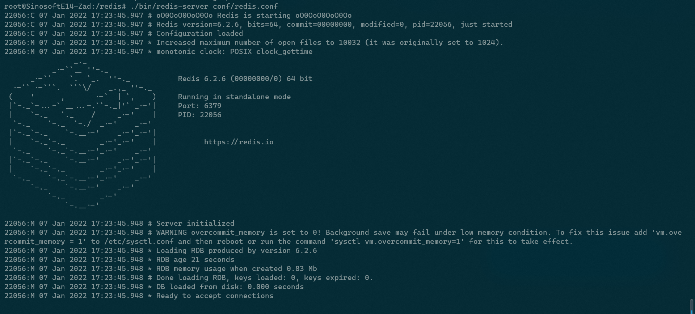
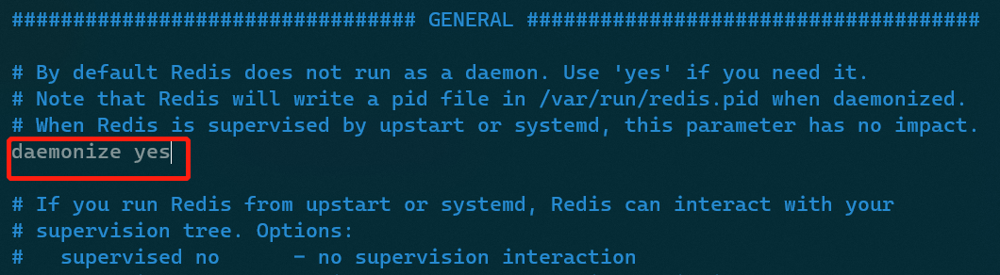
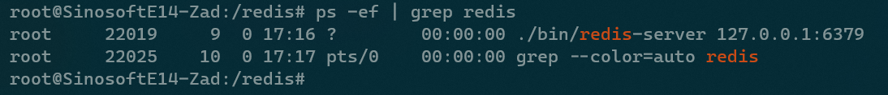

## Chapter 1 Getting Started with Redis


相关主题：

- `Redis` 下载与安装
- `Redis` 启动与关闭
- 用 `redis-cli` 连接 `Redis`
- 获取服务器信息
- 理解 `Redis` 事件模型
- 理解 `Redis` 协议

---


## 1.0 简介

定义：`Redis` 是一种很流行的、基于内存的、轻量级键值对数据库。严格来讲，是一种数据结构的服务器（[Matt Stancliff](https://matt.sh/thinking-in-redis-part-one)）。

名称由来：**RE**mote **DI**ctionary **S**erver，由于在内存中原生实现了多种数据结构，并提供了大量操作这些数据结构的 API 接口，故而得名。

特点：

- 命令处理方面性能卓越；
- 高可用、高可扩展的架构设计；
- 数据持久化的特性，可提供长期运行的数据存储服务


## 1.1 下载与安装

`Redis` 在 `GitHub` 上异常活跃，由于提交的大量 `pull request` 几乎都能得到作者 `Antirez` 的及时处理，`Redis` 的发布周期也十分迅速。建议尽可能使用最新版（原书版本为 `v4.0.1`，目前稳定版为 `v6.2.6`），这也是 `Redis` 的最佳实践之一。

Redis 是用 C 语言编写的，各主流 Linux 系统的软件库中也提供了相应的二进制安装包，只是版本略有落后。

Redis 下载：https://redis.io/download

若要在 Linux 系统编译源码安装 Redis，需要确保 `gcc` 编译器及 C 语言库 `libc` 可用。

若从操作系统的软件库安装 Redis，只需要确保主机正常联网即可。

### 1.1.1 源码编译安装

安装步骤：

```bash
# under WSL environment (2022-1-7 15:15:22)
# Set up building tools
$ apt-get update
$ sudo apt-get install build-essential
$ mkdir /redis
$ cd /redis 
# download latest redis -- using curl 
$ curl http://download.redis.io/releases/redis-6.2.6.tar.gz > redis-6.2.6.tar.gz
# or using wget
$ wget http://download.redis.io/releases/redis-6.2.6.tar.gz
$ tar zxvf redis-4.0.1.tar.gz 
$ cd redis-6.2.6
# Create a directory for the Redis configuration file and copy the default configuration file into it
$ mkdir /redis/conf
$ cp redis.conf /redis/conf/
# building dependencies
$ cd deps 
$ make hiredis lua jemalloc linenoise 
$ cd .. 
$ make
```

当看到如下提示内容，表示编译成功：

```markdown
Hint: It's a good idea to run 'make test' ;)

make[1]: Leaving directory '/redis/redis-6.2.6/src'
```

接下来安装 `Redis`：

```bash
$ make PREFIX=/redis install 
# run test
$ make test
```

实测发现当前 `WSL` 环境的 `TCL` 工具版本较低，测试中断。根据系统建议，需要升级到 `8.5` 以上：

```markdown
You need tcl 8.5 or newer in order to run the Redis test
```

升级 `tcl` 工具到 `8.6.1` （详见 [CSDN 博文](https://blog.csdn.net/a1209849629/article/details/105757593/)）：

```bash
$ wget http://downloads.sourceforge.net/tcl/tcl8.6.1-src.tar.gz  
$ sudo tar xzf tcl8.6.1-src.tar.gz -C /usr/local/  
$ cd /usr/local/tcl8.6.1/unix/  
$ sudo ./configure  
$ sudo make  
$ sudo make install
```

再次回到 `/redis/redis-6.2.6` 目录执行测试（运行成功）：

```bash
$ make test
...
Testing solo test
[ok]: Active defrag
[ok]: Active defrag big keys
[ok]: Active defrag big list
[ok]: Active defrag edge case
[64/64 done]: defrag (57 seconds)

                   The End

Execution time of different units:
  0 seconds - unit/printver
  0 seconds - unit/type/incr
...
  57 seconds - defrag

\o/ All tests passed without errors!

Cleanup: may take some time... OK
make[1]: Leaving directory '/redis/redis-6.2.6/src'
```

最后查看 `/redis/bin` 目录下的 `Redis` 二进制文件是否已生成（安装成功）：

```bash
# verify Redis binary files have been generated
$ ls /redis/bin/
redis-benchmark  redis-check-aof  redis-check-rdb  redis-cli  redis-sentinel  redis-server
```


### 1.1.2 软件库默认在线安装

```bash
$ sudo apt-get update 
$ sudo apt-get install redis-server 
$ which redis-server 
```


### 1.1.3 Windows 版安装

下载 Windows 版安装包：https://github.com/MicrosoftArchive/redis/releases

目前最新版为 2016 年 7 月 1 日发布的 [v3.2.100](https://github.com/microsoftarchive/redis/releases/tag/win-3.2.100)

下载并双击 `.msi` 安装包即可。


### 1.1.4 注意事项

Redis 遵守版本管理标准规范，版本格式为：`major.minor.patch`。次版本若为偶数，表示稳定版；奇数表示非稳定版。

源码编译安装和系统默认安装的区别，在于前者可在编译时添加优化或调试用的配置参数，并能自定义安装路径。

`bin` 文件夹下的主要二进制文件如下：

- `redis-server`
- `redis-sentinel`
- `redis-cli`
- `redis-check-rdb`
- `redis-check-aof`
- `redis-benchmark`


## 1.2 启动与关闭

本节示例代码均在 `/redis/` 文件夹下进行。

### 1. 默认配置启动

```bash
$ bin/redis-server
```

### 2. 手动指定配置文件启动

```bash
$ bin/redis-server conf/redis.conf
```

此时无法进行其他操作，当前控制被占用：




### 3. 通过 `init.d` 脚本启动

```bash
$ /etc/init.d/redis-server start
```


### 4. 作为 `daemon` 守护进程启动

```bash
# edit configuration file
$ vim conf/redis.conf
daemonize yes 
$ bin/redis-server conf/redis.conf
```

修改情况：



再次通过配置文件启动 `Redis`（后台执行成功，不影响后续操作）：

```bash
$ ./bin/redis-server conf/redis.conf
# check redis status
```

结果如下（启动成功）：




### 5. 使用 `kill pid` 关闭

```bash
$ ps -ef | grep redis
root     22083     9  0 17:37 ?        00:00:00 ./bin/redis-server 127.0.0.1:6379
root     22091    10  0 17:49 pts/0    00:00:00 grep --color=auto redis
$ kill 22083
```


### 6. 使用 `redis-cli` 关闭

```bash
$ cd /redis 
$ bin/redis-cli shutdown 
```


### 7. 通过 `init.d` 脚本关闭（系统在线安装）

```bash
$ /etc/init.d/redis-server stop 
```


### 8. 注意事项

一台主机可以运行多个 `Redis` 实例，只要指定不同的配置信息即可，如绑定不同的端口、不同的数据持久化路径、不同的日志路径等等。

`Redis` 中 **实例**（`instance`）的本质，是 `redis-server` 的一个进程（`process`）。

`Redis` 的关闭可能涉及数据完整性的问题，因此需要格外注意。应该尽量避免使用 `kill` 命令强制中断。推荐使用客户端的 `shutdown` 命令。

> 执行 `shutdown` 命令的内部先后顺序：
>
> 1. 首先停止 `redis-server` 的所有客户端连接；
> 2. 然后清理可能存在的 `.pid` 文件和 `socket` 文件；
> 3. 最后才会推出 `Redis` 进程。
>
> 这样的执行策略可以最大限度保证数据完整性不被破坏。

如果要在一台主机部署多个参数不同的 `Redis` 实例，可以将公共参数放到一个同一的配置文件，然后各实例的定制化参数在 `redis-server` 命令中单独指定。这样可以将维护多处配置文件的情况降至最低。不同的实例可以通过 `ps` 命令获取 `pid` 加以区分。


## 1.3 用 `redis-cli` 连接 Redis

`redis-cli` 是 `bin` 目录下最常用的客户端工具。

```bash
# Start redis
$ cd /redis
$ ./bin/redis-server conf/redis.conf
# Connect 
$ bin/redis-cli 
127.0.0.1:6379> set foo value1
OK
127.0.0.1:6379> set bar value2
OK
127.0.0.1:6379> get foo
"value1"
127.0.0.1:6379> get bar
"value2"
# shutdown
127.0.0.1:6379> shutdown
not connected>
# press 'quit' or 'exit' to exit
not connected> quit
127.0.0.1:6379> exit
```

通过命令行关闭 `Redis` 后，服务端随即关闭，此时直接重连将报错：

```bash
127.0.0.1:6379> shutdown
not connected> quit
$ ./bin/redis-cli
Could not connect to Redis at 127.0.0.1:6379: Connection refused
not connected> 
```

若想恢复连接状态，必须重新启动 `Redis` 服务端。

默认情况下，`redis-cli` 通过默认端口 `6379` 连接到在 `localhost` 上运行的 `Redis` 实例。`redis-cli` 命令还可以通过 `-h` 指定 `IP`、通过 `-p` 指定端口号、通过 `-a` 指定访问密码。


## 1.4 获取服务器信息


## 1.5 理解 `Redis` 事件模型


## 1.6 理解 `Redis` 协议