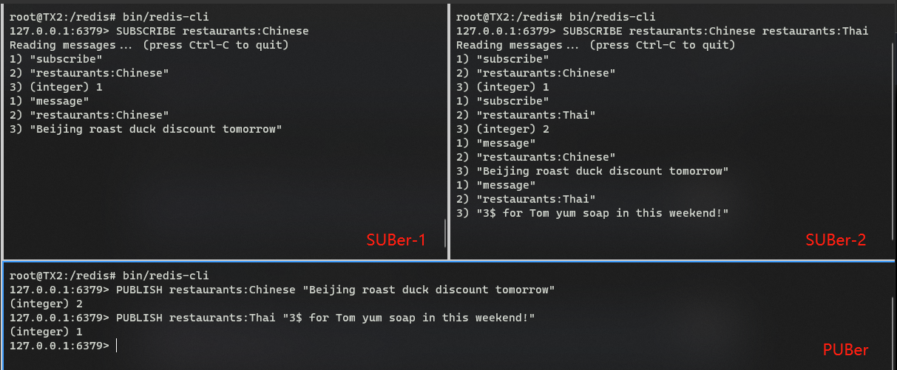
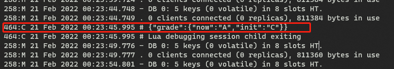
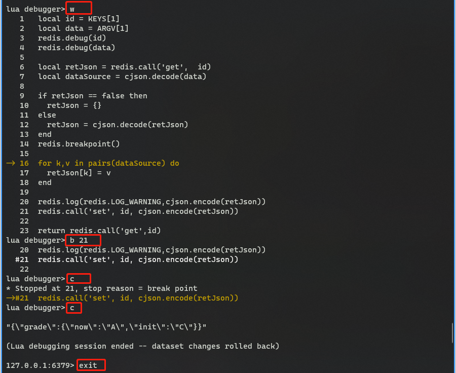

# 第三章 数据特性

相关主题如下：

- 使用位图
- 为 `key` 设置过期时间
- 使用 `SORT` 排序
- 使用 `pipelines` 管道
- 理解 `Redis` 中的事务
- 使用 `PubSub` 发布订阅模式
- 使用 `Lua` 脚本
- 调试 `Lua` 脚本

---

## 3.0 简介

`Redis` 除了第二章介绍的数据类型外，还提供了不少实用的数据特性，理解这些特性能让今后的工作更轻松。本章主要介绍并演示以下特性：

|         数据特性         | 演示内容                                                     |
| :----------------------: | ------------------------------------------------------------ |
|   位图（**Bitmaps**）    | 演示位图在一定条件下替代字符串以节省内存空间的操作方法。     |
| 有效期（**Expiration**） | `Redis` 作为内存数据库常被用作缓存，因此必须对瞬态数据（`transient data`）设置过期时间。本章将演示对 `key` 设置过期时间的方法。 |
|   排序（**Sorting**）    | 演示 `SORT` 命令的使用。                                     |
|   管道（**Pipeline**）   | 演示 `Redis` 管道的使用，弄清它在多语句执行方面能提升性能的具体原因。 |
| 事务（**Transactions**） | `Redis` 支持类似 `RDBMS` 的事务操作，但又不同于 `RDBMS`，本章将进行演示。 |
|  发布订阅（**PUBSUB**）  | `Redis` 可以被看作成一个消息交换通道，本章演示 `Redis` 发布订阅模式的简单应用。 |
|   编写/调试 `Lua` 代码   | `Lua` 是一种旨在嵌入其它应用程序的脚本语言，可用于捆绑几个操作并使其原子化；本章将演示 `Lua` 脚本的编写、执行与调试。 |


## 3.1 使用位图（`Bitmaps`）

位图是一个 `bit` 位的数组（也叫位数组、位向量）。`Redis` 位图不是新的数据类型，其底层数据结构仍是 `string` 字符型。由于字符串本就是一个二进制大对象（`blob`），因此可以视为位图。在一定情况下，使用位图来存储布尔值信息可以节省大量的内存空间。

本节将利用位图来存储一个标志位，用于记录顾客是否使用过 `Relp` 应用上的某个功能。假设 `Relp` 的用户都有一个唯一且递增的身份 `id` 编号，此 `id` 就可以用位图的偏移量（`offset`）来表示；而标志位是一个布尔型的属性值，可以用位图的位值（`bit value`）来表示。

演示如下：

```bash
# SETBIT key offset value
127.0.0.1:6379> SETBIT "users_tried_reservation" 100 1
(integer) 0
# GETBIT key offset
127.0.0.1:6379> GETBIT "users_tried_online_orders" 400
(integer) 0
127.0.0.1:6379> BITCOUNT "users_tried_reservation"
(integer) 1
# BITOP operation destkey key [key ...]
127.0.0.1:6379> BITOP AND "users_tried_both_reservation_and_online_orders" "users_tried_reservation" "users_tried_online_orders"
(integer) 13
# BITCOUNT key [start end [BYTE|BIT]]
127.0.0.1:6379> BITCOUNT "users_tried_both_reservation_and_online_orders"
(integer) 0
127.0.0.1:6379>
```

其中，`BITOP` 后可跟 `AND`、`OR`、`XOR`、`NOT` 运算符，分别表示进行位与、位或、位异或、位非运算，然后将结果存入第一个 `key` 中。代码第 10 行表示查询同时使用过 **餐厅预订** 和 **在线下单** 的用户 ID。

`Redis` 中的位图数据结构示意图如下：


> **知识拓展**

上例中也可以使用 `set` 集合来计数。接下来从内存使用情况对比两者的差别。

位图中，每个用户无论是否用过该功能，都会占用一个 `bit` 位。假设 `Relp` 用户数有 20 亿，则需要分配 20 亿 `bit` 位内存，约 **238.42MB**（= `2e+9 / 8 / 1024 / 1024`）。换用 `Redis` 集合，则只需要对使用过功能的用户 `ID` 进行存储。假设用户 `ID` 是以 8 个字节（`byte`，1 `byte` = 8 `bit`）的整数进行存储，且约 80% 的用户使用过 `Relp` 这款应用，则将占用近 **11.9GB**（= `18e+8 * 8 / 1024 / 1024 / 1024`）的内存。当集合中的元素非常大时，位图较集合更节省内存资源。但如果 `Relp` 不那么受追捧，则使用集合更合理。比如使用率仅为 1%，则两千万个 ID 只需要 **152.59MB** 空间，而位图还是需要 **238.42MB** 内存，且值的分布更稀疏（假设位图中的值都是均匀分布的）。

由于在稀疏位图上设置一个 **位值** 可能阻断 `Redis` 服务器，尤其是 **偏移量** 极大而位图中的值又不多的情形，此时 `Redis` 必须立即分配内存来扩大位图。

`Redis` 位图的更多用法，详见：https://redis.io/topics/data-types-intro 


## 3.2 为 `key` 设置过期时间

除了通过 `DEL` 或 `UNLINK` 命令来手动删除一个 `key`，还可以通过设置过期时间让 `Redis` 自动删除 `key`。

本例用一个 `list` 列表来存放当前位置附近的五家餐馆 ID，假设当前位置变动频繁，则应在列表 `key` 上设置过期时间；一旦过期则重新计算定位结果。

具体演示如下：

```bash
# init the list
127.0.0.1:6379> LPUSH "closest_restaurant_ids" 109 200 233 543 222
(integer) 5
# EXPIRE key seconds:
127.0.0.1:6379> EXPIRE "closest_restaurant_ids" 300
(integer) 1
# TTL key: return the remaining Time To Live of a key
127.0.0.1:6379> TTL "closest_restaurant_ids"
(integer) 292
127.0.0.1:6379> EXISTS closest_restaurant_ids
(integer) 1
# 300s later
127.0.0.1:6379> EXISTS closest_restaurant_ids
(integer) 0
# -2 if the key does not exist; -1 if the key exists but has no associated expire
127.0.0.1:6379> TTL "closest_restaurant_ids"
(integer) -2
127.0.0.1:6379>
```

设置了超时的 `key`，过期时间会以一个绝对的 `UNIX` 时间戳进行存储；这样即便 `Redis` 服务器停止一段时间，只要重新启动时的时间超过了这个时间戳，这个 `key` 仍然会过期。访问一个过期的 `key`，服务器会立即从内存中清除该 `key`，这种方式也称为 **被动删除**。如果一直不访问这个过期的 `key`， `Redis` 还会通过定期运行一个概率算法来 **主动删除** 这样的 `key`。具体来说，`Redis` 将随机选择 20 个与超时设置相关的 `key`，发现过期则立即删除；如果选中的键中超过 25%（5个） 的都被删了，`Redis` 将再次选择 20 个 `key` 并重复该过程。默认情况下，**此进程每秒执行 10 次**，可通过配置文件中的 `hz` 值进行配置。


> **知识拓展**

清除一个 `key` 的超时设置，方法如下：

1. 运行 `PERSIST` 命令将其持久化；
2. 该 `key` 对应的值被替换（`GET`、`GETSET`、及 `*STORE` 命令），或 `key` 被删除；但要注意，删除的 **目标** 如果是 `Redis` 列表、集合、散列表中的 **元素** 则不会影响到 `key` 的超时；
3. 原 `key` 被重命名为一个不含超时设置的新 `key`；（实操验证失败？？）
4. 利用 `TTL` 返回的结果判定一个 `key` 是否含有超时设置：
   1. 返回 `-1` 表示没有超时设置；
   2. 返回 `-2` 表示该 `key` 不存在；可能是超时后自动删除的，也可能从未定义过；

`EXPIREAT` 命令与 `EXPIRE` 类似，但采用的是一个绝对 `UNIX` 时间戳做参数。

`Redis` 2.6 版后，`PEXIRE` 和 `PEXIREAT` 能以 **毫秒** 为单位指定 `key` 的超时时间。

由于 `Redis` 何时主动删除过期的 `key` 是不可预测的，因此有可能某些过期的 `key` 永远不会被删除。如果过期 `key` 太多没有清理干净，可以执行 `SCAN` 命令来主动触发 **被动过期**。

更多 `EXPIRE` 说明，详见文档：https://redis.io/commands/expire


## 3.3 使用 `SORT` 排序

`Redis` 的列表或集合都是无序的，有序集 `zset` 也只是按权重值排序。然而有时需要不按权重、自定义排序规则，这时可以使用 `SORT` 命令。

演示如下：

```bash
# Sort numeric elements
127.0.0.1:6379> SADD "user:123:favorite_restaurant_ids" 200 365 104 455 333
(integer) 5
127.0.0.1:6379> SORT "user:123:favorite_restaurant_ids"
1) "104"
2) "200"
3) "333"
4) "365"
5) "455"
# sort non-numeric elements: by lexicographical order
127.0.0.1:6379> SADD "user:123:favorite_restaurants" "Dunkin Donuts" "Subway" "KFC" "Burger King" "Wendy's"
(integer) 5
127.0.0.1:6379> SORT "user:123:favorite_restaurants" ALPHA
1) "Burger King"
2) "Dunkin Donuts"
3) "KFC"
4) "Subway"
5) "Wendy's"
# SORT key ALPHA LIMIT start count: get the first three elements
127.0.0.1:6379> SORT "user:123:favorite_restaurants" ALPHA LIMIT 0 3
1) "Burger King"
2) "Dunkin Donuts"
3) "KFC"
# sort in descending order
127.0.0.1:6379> SORT "user:123:favorite_restaurants" ALPHA DESC
1) "Wendy's"
2) "Subway"
3) "KFC"
4) "Dunkin Donuts"
5) "Burger King"
127.0.0.1:6379>
```


> **知识拓展**

有时我们不想按元素的值来排序，而是通过包含这些值的其他 `key` 所对应的权重来排序。例如，在形如 `restaurnat_rating_200` 的键中定义餐馆综合评分来进行排序，其中 200 是餐馆的 ID。 这也可以在 `SORT` 中完成。如果不想直接按元素的值（如 `ID`）来排序，而是按一组包含 ID 的键对应的权重值来排序，则可以使用 `SORT` 命令的 `BY pattern` 选项实现：

```bash
# init FK-weight pairs
127.0.0.1:6379> SET "restaurant_rating_200" 4.3
OK
127.0.0.1:6379> SET "restaurant_rating_365" 4.0
OK
127.0.0.1:6379> SET "restaurant_rating_104" 4.8
OK
127.0.0.1:6379> SET "restaurant_rating_455" 4.7
OK
127.0.0.1:6379> SET "restaurant_rating_333" 4.6
OK
# using BY pattern
127.0.0.1:6379> SORT "user:123:favorite_restaurant_ids" BY restaurant_rating_* DESC
1) "104"
2) "455"
3) "333"
4) "200"
5) "365"
127.0.0.1:6379>
```

可以看到，按权重的大小逆序排列，应该是 `4.8 > 4.7 > 4.6 > 4.3 > 4.0`，因此最终的结果为 `104 > 455 > 333 > 200 > 365`。

再进一步，如果希望输出的是 `ID` 对应的餐馆名称，则可以通过 `SORT` 的 `GET pattern` 选项来实现，其中的 `pattern` 是模糊匹配的模式，例如：

```bash
# init ID-name pairs
127.0.0.1:6379> SET "restaurant_name_200" "Ruby Tuesday"
OK
127.0.0.1:6379> SET "restaurant_name_365" "TGI Friday"
OK
127.0.0.1:6379> SET "restaurant_name_104" "Applebee's"
OK
127.0.0.1:6379> SET "restaurant_name_455" "Red Lobster"
OK
127.0.0.1:6379> SET "restaurant_name_333" "Boiling Crab"
OK
# using GET pattern
127.0.0.1:6379> SORT "user:123:favorite_restaurant_ids" BY restaurant_rating_* DESC GET restaurant_name_*
1) "Applebee's"
2) "Red Lobster"
3) "Boiling Crab"
4) "Ruby Tuesday"
5) "TGI Friday"
127.0.0.1:6379>
```

注意——

- `DESC` 无需按文档提示写到最后；
- `GET pattern` 可以出现多次；
- `GET #` 表示获取元素本身；
- 如果希望将排序结果以一个列表的形式存入一个 `key`，可以使用 `STORE destkey` 选项：

```bash
127.0.0.1:6379> SORT "user:123:favorite_restaurant_ids" BY restaurant_rating_* DESC GET restaurant_name_* STORE user:123:favorite_restaurant_names:sort_by_rating
(integer) 5
127.0.0.1:6379> LRANGE user:123:favorite_restaurant_names:sort_by_rating 0 -1
1) "Applebee's"
2) "Red Lobster"
3) "Boiling Crab"
4) "Ruby Tuesday"
5) "TGI Friday"
127.0.0.1:6379>
```

最后来看看 `Redis` 排序的算法复杂度。`SORT` 命令的时间复杂度是 ***O( N + M \* log( M ) )***。其中 `N` 为列表或集合的元素个数，`M` 为排序结果的元素个数。给定一个 `SORT` 运算的时间复杂度，`Redis` 服务器的性能则随着排序数据量的增大而降低。

更多 `SORT` 命令的介绍，详见 `Redis` 文档：https://redis.io/commands/sort


## 3.4 使用 `pipelines` 管道

第一章中介绍过，`Redis` 服务器和客户端之间通过 `RESP` 协议进行通信。通常双方通信的过程如下：

1. 客户端发送命令到服务器；
2. 服务器接收命令并将其放入 **执行队列**（`Redis` 是单线程的命令执行模式）；
3. 执行具体命令；
4. 服务器将执行结果返给客户端。

该过程经历的全部时间，称为 **往返时间**（`round-trip time`，简称 `RTT`）。可以看到，步骤 2 和 3 取决于服务器，而步骤 1 和 4 则取决于双方通信的网络延迟情况。若需执行多条命令，网络传输耗费的时间将占主要，因为在 `Redis` 服务端执行命令需要的时间通常很短。这一过程可以通过 `Redis` 的管道命令进行加速。

`Redis` 管道命令（`pipeline`）的基本思想是在客户端捆绑多个命令，然后用一次命令收发完全整个任务，无需依次等待每条命令从服务端返回结果再执行下一条；由于是在所有命令执行完毕后一次性返回结果，步骤 1 和步骤 4 也只发生一次，总执行时间由此大大减少。

演示如下：

```bash
# install dos2unix tools in Ubuntu
$ sudo apt-get install dos2unix
# create script file
$ vim pipeline.txt
#################
set mykey myvalue
sadd myset value1 value2
get mykey
scard myset
#################
```

由于每一行必须由 `\r\n` 结尾，须使用 `unix2dos` 命令进行批量转换：

```bash
$ unix2dos pipeline.txt
unix2dos: converting file pipeline.txt to DOS format...
# using pipeline
$ cat pipeline.txt | bin/redis-cli --pipe
All data transferred. Waiting for the last reply...
Last reply received from server.
errors: 0, replies: 4
$ 
```

其中 `--pipe` 选项会将 `stdin` 中的所有命令一次性发送到 `Redis` 服务器，大大减少往返时间。

此外，这些命令的格式符合原生 `RESP` 协议要求，与上例中等效的操作如下：

```bash
$ echo '*3\r\n$3\r\nSET\r\n$5\r\nmykey\r\n$7\r\nmyvalue\r\n*4\r\n$4\r\nSADD\r\n$5\r\nmyset\r\n$6\r\nvalue1\r\n$6\r\nvalue2\r\n*2\r\n$3\r\nGET\r\n$5\r\nmykey\r\n*2\r\n$5\r\nSCARD\r\n$5\r\nmyset\r\n' > datapipe.txt
$ echo -e "$(cat datapipe.txt)" | bin/redis-cli --pipe
All data transferred. Waiting for the last reply...
Last reply received from server.
errors: 0, replies: 4
$ 
```

以上演示了如何用 `Redis` 的管道命令、以原始 `RESP` 协议向 `Redis` 服务器发送多条命令的具体方法。管道命令常用在基于某种具体编程语言的 `Redis` 客户端中，在第四章——《用 `Redis` 进行开发》中会具体讨论。

有关管道命令的更多用法，详见 `Redis` 官方文档：https://redis.io/topics/pipelining


## 3.5 理解 `Redis` 中的事务

关系型数据库中的事务（`transaction`），是指能作为原子级操作而执行的一组操作——这意味着这些操作将作为一个整体，要么全部成功，要么全部失败。而 `Redis` 的事务则截然不同。本节演示 `Redis` 事务的应用，并对比两者的差异。

本示例假设为 `Relp` 应用的某餐厅组织一次优惠券代码秒杀活动，优惠券代码仅有五个，当前剩余数量用 `counts:seckilling` 作为 `key`。全过程伪代码如下：

```python
# Initiate the count of coupon codes: 
SET("counts:seckilling", 5);   
 
# Start decreasing the counter: 
WATCH("counts:seckilling");   
count = GET("counts:seckilling"); 
MULTI();  
if count > 0 then 
  DECR("counts:seckilling", 1); 
  EXEC();   
  if ret != null then 
    print "Succeed!" 
  else 
    print "Failed!" 
else 
  DISCARD();   
print "Seckilling Over!" 
```

标的售罄（`overselling`）也是设计秒杀应用时的一个难题，原因在于获取当前标的数量存在竞争机制：当前业务场景下的计数可能是有效的，也可能在递减时已被其他请求修改。本节示例将使用 `Redis` 事务来解决这个问题：

- 首先，对 `key` 使用 `WATCH` 命令，来标识这个 `key` 是否在执行 `EXEC` 命令之前就已经被改动过；若改动过，则取消整个事务，然后拿到计数器的值；
- 其次，使用 `MULTI` 命令开启一个 `Redis` 事务。若计数器的值无效，则通过 `DISCARD` 命令停止当前事务；否则继续对计数器递减；
- 最后是执行事务。由于之前运行了 `WATCH`，`Redis` 会侦听到 `counts:seckilling` 的值的变动。一旦发生改变，当前事务就会中断（`abort`）。这个中断就可视为秒杀操作未成功。

可以看到，利用 `Redis` 的事务特性可以有效避免秒杀标的售罄的发生。

`Redis` 事务和 `RDBMS` 事务的最大区别，在于 `Redis` **没有事务回滚的特性**。

总地来讲，`Redis` 事务在不同的处理机制下，会产生两类报错：

1. 执行命令的语法报错：由于语法错误会在组织队列时被检测到，因此整个事务的内操作都将失效：

```bash
127.0.0.1:6379> MULTI
OK
127.0.0.1:6379(TX)> SET FOO BAR
QUEUED
127.0.0.1:6379(TX)> GOT FOO
(error) ERR unknown command `GOT`, with args beginning with: `FOO`,
127.0.0.1:6379(TX)> INCR MAS
QUEUED
127.0.0.1:6379(TX)> EXEC
(error) EXECABORT Transaction discarded because of previous errors.
127.0.0.1:6379> get MAS
(nil)
127.0.0.1:6379>
```

可见，有语法错误（命令人为写错，或调用的数据类型和命令不一致）时，后续的 `INCR MAS` 并没有生效。

2. 执行过程中的报错：这通常发生在成功产生命令队列之后，报错将出现在执行过程中。此时该命令后面的操作 **会继续执行**，而不会像 `RDBMS` 事务那样立即回滚。例如：

```bash
127.0.0.1:6379> MULTI
OK
127.0.0.1:6379(TX)> SET foo bar
QUEUED
127.0.0.1:6379(TX)> INCR foo
QUEUED
127.0.0.1:6379(TX)> SET foo mas
QUEUED
127.0.0.1:6379(TX)> GET foo
QUEUED
127.0.0.1:6379(TX)> EXEC
1) OK
2) (error) ERR value is not an integer or out of range
3) OK
4) "mas"
127.0.0.1:6379> get foo
"mas"
127.0.0.1:6379>
```

可见，第 12 至 15 行的结果就是上面四句操作命令的执行结果，后面两句不会因为第二句报错就终止运行。

官方文档就 `Redis` 事务不支持回滚的问题答复如下：

> **Why `Redis` does not support roll backs?**
>
> If you have a relational databases background, the fact that `Redis` commands can fail during a transaction, but still `Redis` will execute the rest of the transaction instead of rolling back, may look odd to you.
>
> However there are good opinions for this behavior:
>
> - `Redis` commands can fail **only if called with a wrong syntax** (and the problem is not detectable during the command queueing), **or against keys holding the wrong data type**: this means that in practical terms a failing command is the result of a **programming errors**, and a kind of error that is very likely to be detected during development, and not in production.
> - `Redis` is internally simplified and faster because it does not need the ability to roll back.
>
> An argument against `Redis` point of view is that bugs happen, however it should be noted that in general the **roll back does not save you from programming errors**. For instance if a query increments a key by 2 instead of 1, or increments the wrong key, there is no way for a rollback mechanism to help. Given that no one can save the programmer from his or her errors, and that the kind of errors required for a `Redis` command to fail are unlikely to enter in production, we selected the simpler and faster approach of not supporting roll backs on errors.

根据官方文档，`Redis` 命令只会在出现语法错误或调用数据类型错误时执行失败，即发生 **编程错误** 时。而编程错误是在开发环境下就可以被修复，不大可能在生产环境出现；更重要的是，开发者不能寄希望于通过 **事务回滚** 来避免由于自身原因导致的报错。因此索性不引入回滚特性，这样内部设计反而更加简洁，性能也会因此更卓越。

更多 `Redis` 事务相关讨论，详见：https://redis.io/topics/transactions，查看事务相关命令，详见：https://redis.io/commands#transactions

（原书未对秒杀活动的实现进行演示，仅给出了伪代码）


## 3.6 使用 `PubSub` 发布订阅模式

**发布-订阅**（`PubSub`）模式是一种经典的消息传递模式，其历史可以追溯到 1987 年（据维基百科）。简单来说，想要发布事件的 **发布者**（`publishers`）将消息发送到发布订阅频道（`PubSub channel`），该频道将事件传递给对该频道感兴趣的每个 **订阅者**（`subscriber`）。 许多流行的消息中间件，如 `Kafka` 和 `ZeroMQ`，都利用这种模式来构建消息传递系统，`Redis` 也是如此。本节将以一个推送推荐信息的消息推送系统为例，演示 `Redis` 的 `PubSub` 模式。

打开三个控制台，分别模拟两个订阅者、一个发布者：

- `console-A`：`SUBer-1`
- `console-B`：`SUBer-2`
- `console-C`：`PUBer`

然后令 `SUBer-1` 只订阅中式餐馆、`SUBer-2` 同时订阅中式和泰式餐馆；接着发布者 `PUBer` 分别向中式餐馆、泰式餐馆分别推送一次数据，然后观察各订阅者的输出结果：

```bash
# SUBer-1: subscribe Chinese restaurant channel
127.0.0.1:6379> SUBSCRIBE restaurants:Chinese
Reading messages... (press Ctrl-C to quit)
1) "subscribe"
2) "restaurants:Chinese"
3) (integer) 1
# SUBer-2: subscribe both Chinese and Thailand restaurant channels
127.0.0.1:6379> SUBSCRIBE restaurants:Chinese restaurants:Thai
Reading messages... (press Ctrl-C to quit)
1) "subscribe"
2) "restaurants:Chinese"
3) (integer) 1
1) "subscribe"
2) "restaurants:Thai"
3) (integer) 2
# PUBer: publish a message to Chinese channel (return the number of subscribers)
127.0.0.1:6379> PUBLISH restaurants:Chinese "Beijing roast duck discount tomorrow"
(integer) 2
127.0.0.1:6379> 
# Both subscribers receive the message
1) "message"
2) "restaurants:Chinese"
3) "Beijing roast duck discount tomorrow"
# PUBer: publish a message to Thai channel
127.0.0.1:6379> PUBLISH restaurants:Thai "3$ for Tom yum soap in this weekend!"
(integer) 1
127.0.0.1:6379> 
# Only SUBer-2 receives the message this time
1) "message"
2) "restaurants:Thai"
3) "3$ for Tom yum soap in this weekend!"
```

实测效果如下：



相关命令及注意事项如下——

- `SUBSCRIBE`：用于订阅一个频道，可一次性订阅多个频道，频道名之间用空格隔开；

- `PSUBSCRIBE`：按某种匹配模式批量订阅一组频道；

- `UNSUBSCRIBE`：取消订阅一个或多个频道；

- `PUBSUB`：与子命令结合，用于管理频道，如查看所有在用频道：

  ```bash
  127.0.0.1:6379> pubsub channels
  1) "restaurants:Chinese"
  2) "restaurants:Thai"
  127.0.0.1:6379>
  ```

- 频道生命周期：`Redis` 会自动初始化要订阅的频道（如果不存在的话）；同时，在没有活跃订阅者的情况下回自动销毁该频道。因此 `Redis` 的发布订阅模式下并不存在持久化的数据；换句话说，推送的消息、频道、以及发布订阅模式的关系定义数据并不会存到磁盘上。如果服务器因为某原因退出，这些对象实体就会丢失；

- 推送给没有订阅者的频道：此时推送的消息会被丢弃。换句话说，`Redis` 不能确保消息的交付；而且发布者推送的消息只能被其中一个订阅者处理；

- `Redis` 的发布订阅模式不适合重要消息的传递场景，仅能用于一些简单、快速的通信交流；

- `Redis keyspace notifications`：`Redis` 的键空间通知机制，一种基于 `PubSub` 的特性，支持客户端订阅频道、并接收有关 `Redis` 命令或数据变更情况的已发布事件（`published events`）。

更多 `PubSub` 介绍，详见：https://redis.io/topics/pubsub；相关命令文档，详见：https://redis.io/commands#pubsub；键空间通知机制，详见：https://redis.io/topics/notifications


## 3.7 使用 `Lua` 脚本

`Redis` 是从 2.6 版开始引入 `Lua` 这一轻量级脚本语言的，与 `Redis` 事务类似，`Lua` 脚本也是以原子方式运行，可以作为服务端脚本实现更强大的功能和业务逻辑。本节将演示 `Lua` 脚本在 `Redis` 中的具体应用。

本节示例将使用 `Lua` 脚本更新 `Redis` 中的 `JSON` 字符串。示例 `Lua` 脚本内容如下：

```lua
local id = KEYS[1]
local data = ARGV[1]
local dataSource = cjson.decode(data)

local retJson = redis.call('get', id)
if retJson == false then
    retJson = {}
else
    retJson = cjson.decode(retJson)
end

for k, v in pairs(dataSource) do
    retJson[k] = v
end
redis.call('set', id, cjson.encode(retJson))
return redis.call('get', id)
```

执行以下命令：

```bash
# create Lua script file /redis/coding/lua/updatejson.lua
$ mkdir -p /redis/coding/lua
$ cd /redis/coding/lua/
$ vim updatejson.lua
# execute Lua script using --eval
$ /redis/bin/redis-cli --eval updatejson.lua users:id:992452 , '{"name": "Tina", "sex": "female", "grade": "A"}'
"{\"grade\":\"A\",\"name\":\"Tina\",\"sex\":\"female\"}"
# load script file for future use (SCRIPT LOAD & EVALSHA)
$ /redis/bin/redis-cli SCRIPT LOAD "`cat updatejson.lua`"
"12cc87496f20c0622e56a064214b271a22bcd33d"
# using SHA to update grade field to 'C'
$ /redis/bin/redis-cli EVALSHA 12cc87496f20c0622e56a064214b271a22bcd33d 1 user:id:992452 '{"grade": "C"}'
"{\"grade\":\"C\",\"name\":\"Tina\",\"sex\":\"female\"}"
```

注意——

- `KEY[]` 和 `ARGV[]`：`redis-cli eval` 命令中负责向指定 `Lua` 脚本传参的两个参数，两者通过一个逗号（`,`）分隔；`KEY[]` 与 `ARGV[]` 可以接收多个参数，其参数数组的下标，均从 1 开始；

- 第 12 行中的 1：表示向脚本传入的 `key` 的数量；示例仅一个 `key`，故为 1；该参数后跟 `key` 的具体名称（`user:id:992452`）；

- `redis.call('get', key)`：用于在 `Lua` 脚本中执行 `get` 命令；如果 `key` 不存在则返回 `false`，此时赋一个默认的空表值（`{}`），否则用 `cjson` 进行反序列化；

- 除了使用 `redis-cli` 执行 `Lua` 脚本，还可以使用 `EVAL` 命令；

- 第 9 行：代码是为了方便开发者不必每次都手动指定 `Lua` 文件。通过 `SCRIPT LOAD` 命令可以将脚本缓存到 `Redis` 服务器进程中，并用 `SHA-1` 字符串来标识。使用时只需要在 `EVALSHA` 命令提供该 `SHA-1` 即可。检查 Lua 脚本是否存在可以使用 `SCRIPT EXISTS`：（`SHA-1` 必须完整）

  ```bash
  # (PWD = /redis/coding/lua)
  $ ../../bin/redis-cli
  127.0.0.1:6379> SCRIPT EXISTS 12cc87496f20c0622e
  1) (integer) 0
  127.0.0.1:6379> SCRIPT EXISTS 12cc87496f20c0622e56a064214b271a22bcd33d
  1) (integer) 1
  127.0.0.1:6379>
  ```

- 由于 `Lua` 脚本是以缓存的形式存在于 `Redis` 进程中，一旦重启服务器，脚本即需重新加载。

在需要原子操作时，优先使用 `Lua` 还是 `Redis` 事务呢？作者推荐优先 `Lua` 脚本，因为 `Lua` 脚本可以轻松实现更复杂的逻辑判定和业务需求。

与 `Redis` 事务类似，`Lua` 脚本的执行时间也值得重点关注，它会阻塞服务器处理其他命令。通常脚本在默认执行 5 秒后，就可以通过 `SCRIPT KILL` 命令强制中断，默认时长可通过 `lua-time-limit` 配置项手动控制。如果脚本中的写入命令已被执行，关闭 `Redis` 服务器时可以通过 `SHUTDOWN NOSAVE` 命令取消数据持久化。当 `Lua` 脚本的执行时间不足 5 秒就执行 `SCRIPT KILL` 时，需等到 5 秒以后才能运行。

`Lua` 官方手册：https://www.lua.org/manual/5.4/（整理笔记时的 `Redis` 最新版为 `v6.2.6`，根据官方文档，`Redis` 内部使用 `Lua` 5.1版解释器编译 `Lua` 脚本）

更多 `Redis` 中的 `Lua` 命令，详见：https://redis.io/commands#scripting


## 3.8 调试 `Lua` 脚本

所谓调试，就是监测、诊断、清除程序存在的错误。通常意义的调试包括逻辑检查和变量值的查看，`Redis` 从 3.2 版开始引入了方便 `Lua` 调试的一系列工具，可以在脚本中打印日志信息。本节将进行相关演示。

修改 `Redis` 配置文件 `/redis/conf/redis.conf`：

```properties
logfile "/redis/log/redis.log" 
loglevel debug
```

接着按配置初始化日志文件，执行如下命令：

```bash
# init Redis logfile
$ mkdir log
$ touch log/redis.log
# reboot redis server
$ bin/redis-cli shutdown
$ ./bin/redis-server conf/redis.conf
$ ps -ef | grep redis
root       258     1  0 23:15 ?        00:00:00 ./bin/redis-server 127.0.0.1:6379
root       264   140  0 23:19 tty2     00:00:00 grep --color=auto redis
$ mkdir -p /redis/coding/lua
$ cd /redis/coding/lua
$ vim updatejsondebug.lua
```

脚本内容如下：

```lua
local id = KEYS[1] 
local data = ARGV[1] 
redis.debug(id) 
redis.debug(data) 
 
local retJson = redis.call('get',  id) 
local dataSource = cjson.decode(data) 
 
if retJson == false then 
  retJson = {} 
else 
  retJson = cjson.decode(retJson) 
end 
redis.breakpoint() 
 
for k,v in pairs(dataSource) do 
  retJson[k] = v 
end 
 
redis.log(redis.LOG_WARNING,cjson.encode(retJson)) 
redis.call('set', id, cjson.encode(retJson)) 
 
return redis.call('get',id)
```

脚本实现的功能，是将传入的 `JSON` 字符串，按解析出的键值对逐一更新到 `Redis` 对应的 `key` 上，最后返回该 `key` 上的新值。

在 `redis-cli` 命令中添加 `--ldb` 选项开启 `Lua` 调试模式：

```bash
# Step1: enable Lua debug mode via --ldb option in EVAL command:
$ /redis/bin/redis-cli --ldb --eval updatejsondebug.lua 1 users:id:992398 , '{"grade": {"init":"C","now":"A"}}'
Lua debugging session started, please use:
quit    -- End the session.
restart -- Restart the script in debug mode again.
help    -- Show Lua script debugging commands.

* Stopped at 1, stop reason = step over
-> 1   local id = KEYS[1]
# Step2: type 's' to step over the code line by line
lua debugger> s
* Stopped at 2, stop reason = step over
-> 2   local data = ARGV[1]
lua debugger> s
* Stopped at 3, stop reason = step over
-> 3   redis.debug(id)
lua debugger> s
<debug> line 3: "1"
* Stopped at 4, stop reason = step over
-> 4   redis.debug(data)
lua debugger> s
<debug> line 4: "{\"grade\": {\"init\":\"C\",\"now\":\"A\"}}"
* Stopped at 6, stop reason = step over
-> 6   local retJson = redis.call('get',  id)
lua debugger> s
<redis> get 1
<reply> "{\"grade\":{\"now\":\"A\",\"init\":\"C\"}}"
* Stopped at 7, stop reason = step over
-> 7   local dataSource = cjson.decode(data)
# Step3: type 'p varName' to show the value of the variable named varName
lua debugger> p retJson
<value> "{\"grade\":{\"now\":\"A\",\"init\":\"C\"}}"
# Step4: type 'c' to continue till the breakpoint set in advance
lua debugger> c
* Stopped at 16, stop reason = redis.breakpoint() called
-> 16  for k,v in pairs(dataSource) do
# Step5: type 'w' to show the whole script content
lua debugger> w
   1   local id = KEYS[1]
   2   local data = ARGV[1]
   3   redis.debug(id)
   4   redis.debug(data)
   5
   6   local retJson = redis.call('get',  id)
   7   local dataSource = cjson.decode(data)
   8
   9   if retJson == false then
   10    retJson = {}
   11  else
   12    retJson = cjson.decode(retJson)
   13  end
   14  redis.breakpoint()
   15
-> 16  for k,v in pairs(dataSource) do
   17    retJson[k] = v
   18  end
   19
   20  redis.log(redis.LOG_WARNING,cjson.encode(retJson))
   21  redis.call('set', id, cjson.encode(retJson))
   22
   23  return redis.call('get',id)
# Step6: use 'b LINENUMBER' to insert a break point into the specific line
lua debugger> b 21
   20  redis.log(redis.LOG_WARNING,cjson.encode(retJson))
  #21  redis.call('set', id, cjson.encode(retJson))
   22
lua debugger> c
* Stopped at 21, stop reason = break point
->#21  redis.call('set', id, cjson.encode(retJson))
lua debugger> c

"{\"grade\":{\"now\":\"A\",\"init\":\"C\"}}"

(Lua debugging session ended -- dataset changes rolled back)

127.0.0.1:6379> exit
$ 
```

其中 `Lua` 脚本第 20 行：`redis.log(redis.LOG_WARNING,cjson.encode(retJson))` 用于在 `Redis` 输出一条日志信息。查看日志文件 `/redis/log/redis.log`：

```bash
$ cat redis.log | grep grade
464:C 21 Feb 2022 00:23:45.995 # {"grade":{"now":"A","init":"C"}}
$ 
```

实测效果如下：



`WSL` 下的 `Redis` 服务器 `Lua` 调试模式如下：


通过 `w` 查看脚本并通过 `b` 设置断点：




> 原理剖析

可以看到，调试过程都是不言自明的。调试模式下的各种命令无需强行记忆，可以借助 `ldb` 模式下的 `help` 命令查看：

```bash
lua debugger> help
Redis Lua debugger help:
[h]elp               Show this help.
[s]tep               Run current line and stop again.
[n]ext               Alias for step.
[c]continue          Run till next breakpoint.
[l]list              List source code around current line.
[l]list [line]       List source code around [line].
                     line = 0 means: current position.
[l]list [line] [ctx] In this form [ctx] specifies how many lines
                     to show before/after [line].
[w]hole              List all source code. Alias for 'list 1 1000000'.
[p]rint              Show all the local variables.
[p]rint <var>        Show the value of the specified variable.
                     Can also show global vars KEYS and ARGV.
[b]reak              Show all breakpoints.
[b]reak <line>       Add a breakpoint to the specified line.
[b]reak -<line>      Remove breakpoint from the specified line.
[b]reak 0            Remove all breakpoints.
[t]race              Show a backtrace.
[e]eval <code>       Execute some Lua code (in a different callframe).
[r]edis <cmd>        Execute a Redis command.
[m]axlen [len]       Trim logged Redis replies and Lua var dumps to len.
                     Specifying zero as <len> means unlimited.
[a]bort              Stop the execution of the script. In sync
                     mode dataset changes will be retained.

Debugger functions you can call from Lua scripts:
redis.debug()        Produce logs in the debugger console.
redis.breakpoint()   Stop execution like if there was a breakpoint in the
                     next line of code.
lua debugger>
```

需要强调的是，调试过程中由于分出了一个进程来与调试会话（`debug session`）进行交互，`Redis` 服务器并不会被阻塞，除非手动添加 `--ldb-sync-mode` 选项（需确认自己知道设置为同步后的一系列影响）。这意味着调试模式下进行的所有变更，默认情况下都会自动回滚。

`Redis` 日志的相关内容将在第八章详细讨论。


> 知识拓展

在 `Redis` 的 `Lua` 脚本中查看变量的值，可以直接使用 `print()` 函数，但如果此时 `Redis` 服务器是以守护进程 `daemonize` 模式运行，控制台则无法看到日志输出，因为 `print()` 函数的结果是在 `stdout` 中显示的，如果是 `deamonize` 模式运行，控制台标准输出 `stdout` 模式就会被舍弃。

其他参考资料：

- 完整 **Redis Lua debugger** (**LDB**) 说明，参考官方文档：https://redis.io/topics/ldb
- 更多 `Redis` 下的 `Lua` 命令，详见：https://redis.io/commands/script-debug
- 若对 `Lua` 调试感兴趣，可以看看这篇博文：https://redislabs.com/blog/5-6-7-methods-for-tracing-and-debugging-redis-lua-scripts/（已整理到 [本地仓库](./Methods-for-tracing-and-debugging-redis-lua-scripts.md)）

