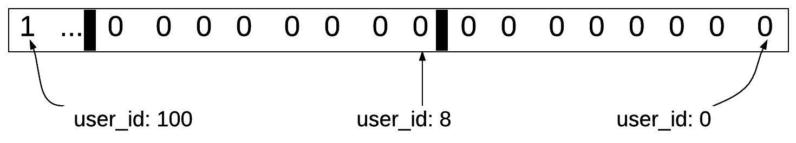

# 第三章 数据特性

相关主题如下：

- 使用位图
- 为 `key` 设置过期时间
- 使用 `SORT` 排序
- 使用 `pipelines` 管道
- 理解 `Redis` 中的事务
- 使用 `PubSub` 发布订阅模式
- 使用 `Lua`
- 调试 `Lua`

---

## 3.0 简介

`Redis` 除了第二章介绍的数据类型外，还提供了不少实用的数据特性，理解这些特性能让今后的工作更轻松。本章主要介绍并演示以下特性：

|         数据特性         | 演示内容                                                     |
| :----------------------: | ------------------------------------------------------------ |
|   位图（**Bitmaps**）    | 演示位图在一定条件下替代字符串以节省内存空间的操作方法       |
| 有效期（**Expiration**） | `Redis` 作为内存数据库常被用作缓存，因此必须对瞬态数据设置过期时间。本章演示了对 `key` 设置过期时间的方法 |
|   排序（**Sorting**）    | 演示 `SORT` 命令的使用                                       |
|   管道（**Pipeline**）   | 演示 `Redis` 管道的使用，弄清它在多条命令执行方面能提升性能的具体原因 |
| 事务（**Transactions**） | `Redis` 支持类似 `RDBMS` 的事务操作，但又不同于 `RDBMS`，本章将进行演示； |
|  发布订阅（**PUBSUB**）  | `Redis` 可以看作是一个消息交换的渠道，本章演示 `Redis` 发布订阅模式的简单应用 |
|   编写/调试 `Lua` 代码   | `Lua` 是一种旨在嵌入其它应用程序的脚本语言，可用于捆绑几个操作并使其原子化。示例将演示 `Lua` 脚本的编写、执行与调试 |


## 3.1 使用位图（`Bitmaps`）

位图是一个 `bit` 位的数组（也叫位数组、位向量）。`Redis` 位图不是新的数据类型，其底层数据结构还是 `string` 字符型。由于字符串本就是一个二进制大对象（`blob`），因此可以视为位图。在一定情况下，使用位图来存储布尔值信息可以节省大量的内存空间。

本节将利用位图来存储一个标志位，用于记录顾客是否使用过 `Relp` 示例应用上的某个功能。假设 `Relp` 的用户都有一个唯一且递增编号的身份 `id`，此 `id` 就可以用位图的偏移量（`offset`）来表示；而标志位是一个布尔型的属性值，可以用位图的位值来表示。

演示如下：

```bash
# SETBIT key offset value
127.0.0.1:6379> SETBIT "users_tried_reservation" 100 1
(integer) 0
# GETBIT key offset
127.0.0.1:6379> GETBIT "users_tried_online_orders" 400
(integer) 0
127.0.0.1:6379> BITCOUNT "users_tried_reservation"
(integer) 1
# BITOP operation destkey key [key ...]
127.0.0.1:6379> BITOP AND "users_tried_both_reservation_and_online_orders" "users_tried_reservation" "users_tried_online_orders"
(integer) 13
# BITCOUNT key [start end [BYTE|BIT]]
127.0.0.1:6379> BITCOUNT "users_tried_both_reservation_and_online_orders"
(integer) 0
127.0.0.1:6379>
```

其中，`BITOP` 后可跟 `AND`、`OR`、`XOR`、`NOT` 运算符，分别表示进行位与、位或、位异或、位非运算，然后将结果存入第一个 `key` 中。代码第 10 行表示查询同时使用过 **餐厅预订** 和 **在线下单** 的用户 ID。

`Redis` 中的位图数据结构示意图如下：




> **知识拓展**

上例中也可以使用 set 集合来计数。接下来从内存使用情况对比两者的差别。

位图中，每个用户无论是否用过该功能，都会占用一个 `bit` 位。假设 `Relp` 用户数有 20 亿，则需要分配 20 亿 `bit` 位内存（约 250 `MB`）。换用 `Redis` 集合，则只需要对使用过功能的用户 `ID` 进行存储。假设用户 `ID` 是以 8 个字节的整数进行存储，且约 80% 的用户使用过 `Relp` 这款应用，则将占用近 12.8 **GB** 的内存。当集合中的元素非常大时，位图较集合更节省内存资源。但如果 `Relp` 不那么火，则使用集合更合理。比如使用率仅为 1%，则两千万个 ID 只需要 160 MB 空间，而位图还是需要 250 MB 内存，且值的分布更稀疏（假设位图中的值是均匀分布的）。

由于在稀疏位图设置位值可能阻断 `Redis` 服务器运行一段时间，尤其是偏移量巨大而位图存的值又不多的情形。此时 `Redis` 必须即刻分配内存以扩大位图本身。

`Redis` 位图的更多用法，详见：https://redis.io/topics/data-types-intro 


## 3.2 为 `key` 设置过期时间

除了通过 `DEL` 或 `UNLINK` 命令来手动删除一个 `key`，还可以通过设置过期时间让 `Redis` 自动删除 `key`。

本节示例用一个 `Redis` 列表来存放距离当前位置最近的五家餐馆 ID，假设当前位置变动频繁，应该在列表对应的 key 上设置过期时间，一旦过期则重新计算定位结果。具体演示如下：

```bash
# init the list
127.0.0.1:6379> LPUSH "closest_restaurant_ids" 109 200 233 543 222
(integer) 5
# EXPIRE key seconds:
127.0.0.1:6379> EXPIRE "closest_restaurant_ids" 300
(integer) 1
# TTL key: return the remaining Time To Live of a key
127.0.0.1:6379> TTL "closest_restaurant_ids"
(integer) 292
127.0.0.1:6379> EXISTS closest_restaurant_ids
(integer) 1
# 300s later
127.0.0.1:6379> EXISTS closest_restaurant_ids
(integer) 0
# -2 if the key does not exist; -1 if the key exists but has no associated expire
127.0.0.1:6379> TTL "closest_restaurant_ids"
(integer) -2
127.0.0.1:6379>
```

设置了超时的 `key`，其过期时间会以一个绝对的 `UNIX` 时间戳进行存储，这样即便 `Redis` 服务器关停一段时间，只要重新启动时的时间超过了这个时间戳，这个 `key` 仍然会过期。访问一个过期的 `key`，服务器会立即从内存中清除该 `key`，这种方式也称为 **被动删除**。如果一直不访问这个过期的 `key`， `Redis` 还会通过定期运行一个概率算法来 **主动删除** 这样的 `key`。具体来说，`Redis` 随机选择 20 个与超时相关的 `key`，发现过期则立即删除；如果选中的键中超过 25% 的都被删了，`Redis` 将再次选择 20 个 `key` 并重复该过程。默认情况下，此进程每秒执行 10 次，可通过配置文件中的 hz 值进行配置。


> **知识拓展**

清除一个 `key` 的超时设置，方法如下：

1. 运行 `PERSIST` 命令将其持久化；
2. 该 `key` 对应的值被替换（`GET`、`GETSET`、及 `*STORE` 命令），或 `key` 被删除；但要注意，删除的如果是 Redis 列表、集合、散列表中的元素则不会影响到 `key`；
3. 原 `key` 被重命名为一个不含超时设置的新 `key`；
4. 利用 `TTL` 返回的结果判定一个 `key` 是否含有超时设置：
   1. 返回 `-1` 表示没有超时设置；
   2. 返回 `-2` 表示该 `key` 不存在；可能是超时后自动删除的，也可能从未定义过；

`EXPIREAT` 命令与 `EXPIRE` 类似，但采用的是一个绝对 `UNIX` 时间戳做参数。

`Redis` 2.6 版后，`PEXIRE` 和 `PEXIREAT` 能以 **毫秒** 为单位指定 `key` 的超时时间。

由于 `Redis` 何时主动删除过期的 `key` 是不可预测的，因此有可能某些过期的 `key` 永远不会被删除。如果过期 `key` 太多没有清理干净，可以执行 `SCAN` 命令来主动触发 **被动过期**。

更多 `EXPIRE` 说明，详见文档：https://redis.io/commands/expire


- 3.3 使用 `SORT` 排序
- 3.4 使用 `pipelines` 管道
- 3.5 理解 `Redis` 中的事务
- 3.6 使用 `PubSub` 发布订阅模式
- 3.7 使用 `Lua`
- 3.8 调试 `Lua`