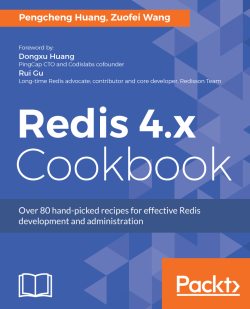

# 《Redis 4.x Cookbook》Learning Notes

## 1. Profiles

|    **Title**    | **Redis 4.x Cookbook** [[buy](https://www.packtpub.com/product/redis-4-x-cookbook/9781783988167)] |
| :-------------: | :----------------------------------------------------------: |
|   **Author**    |               **Pengcheng Huang, Zuofei Wang**               |
| **Publication** |                      **Packt, 2018.2**                       |
|    **Pages**    |                           **374**                            |

> **Introduction**
>
> Redis is considered the world's most popular key-value store database. Its versatility and the wide variety of use cases it enables have made it a popular choice of database for many enterprises. Based on the latest version of Redis, this book provides both step-by-step recipes and relevant the background information required to utilize its features to the fullest. It covers everything from a basic understanding of Redis data types to advanced aspects of Redis high availability, clustering, administration, and troubleshooting. This book will be your great companion to master all aspects of Redis.
>
> The book starts off by installing and configuring Redis for you to get started with ease. Moving on, all the data types and features of Redis are introduced in detail. Next, you will learn how to develop applications with Redis in Java, Python, and the Spring Boot web framework. You will also learn replication tasks, which will help you to troubleshoot replication issues. Furthermore, you will learn the steps that need to be undertaken to ensure high availability on your cluster and during production deployment. Toward the end of the book, you will learn the topmost tasks that will help you to troubleshoot your ecosystem efficiently, along with extending Redis by using different modules.

## 2. Outlines

Status available：:heavy_check_mark:| :hourglass_flowing_sand: | :no_entry:

| No.  |                     Chapter Title                     |          Status          |
| :--: | :---------------------------------------------------: | :----------------------: |
| Ch01 |        [Getting Started with Redis](./Ch01.md)        | :hourglass_flowing_sand: |
| Ch02 |                [Data Types](./Ch02.md)                |        :no_entry:        |
| Ch03 |              [Data Features](./Ch03.md)               |        :no_entry:        |
| Ch04 |          [Developing with Redis](./Ch04.md)           |        :no_entry:        |
| Ch05 |               [Replication](./Ch05.md)                |        :no_entry:        |
| Ch06 |               [Persistence](./Ch06.md)                |        :no_entry:        |
| Ch07 | [Setting Up High Availability and Cluster](./Ch07.md) |        :no_entry:        |
| Ch08 |  [Deploying to a Production Environment](./Ch08.md)   |        :no_entry:        |
| Ch09 |           [Administrating Redis](./Ch09.md)           |        :no_entry:        |
| Ch10 |          [Troubleshooting Redis](./Ch10.md)           |        :no_entry:        |
| Ch11 |    [Extending Redis with Redis Modules](./Ch11.md)    |        :no_entry:        |
| Ch12 |           [The Redis Ecosystem](./Ch12.md)            |        :no_entry:        |
| Ch13 |        [Windows Environment Setup](./Ch13.md)         |        :no_entry:        |
